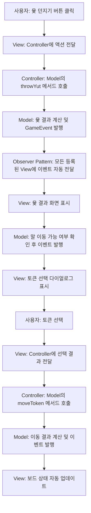

# 윷놀이 게임

윷놀이를 JavaFX와 Swing으로 구현한 멀티 UI를 지원해주는 게임입니다.

## 주요 특징

- **멀티 UI 지원**: JavaFX와 Swing 중 선택 가능
- **동적 크기 조정**: 창 크기에 맞게 보드가 자동으로 스케일링
- **윷놀이 규칙**: 말 잡기, 업기, 분기 선택, 추가 턴 등 모든 규칙 구현
- **테스트 모드**: 원하는 윷 결과를 선택할 수 있는 디버그 모드
- **커스터마이징**: 4-6각형 보드, 2-4명 플레이어, 2-5개 말 설정 가능

## 아키텍처 설계 원리

### 왜 Model과 Controller는 그대로 두고 View만 바꿀 수 있는가?

이 프로젝트는 **MVC (Model-View-Controller) 패턴**과 **Observer 패턴**을 결합하여 설계되었습니다.

#### 1. **완전한 관심사 분리 (Separation of Concerns)**

| 계층 | 역할 | 주요 클래스 | 책임 |
|------|------|-------------|------|
| **Model** | 게임 로직 | • GameState<br>• Player<br>• Token<br>• Board | • 비즈니스 로직 처리<br>• 게임 상태 관리<br>• 데이터 저장 |
| **Controller** | 중재자 | • GameController | • 사용자 입력 처리<br>• Model 제어<br>• 게임 흐름 관리 |
| **View** | UI 표현계층 | • JavaFX View<br>• Swing View | • 사용자 상호작용<br>• 화면 렌더링<br>• 이벤트 표시 |

**데이터 흐름:**
```
사용자 입력 → View → Controller → Model → 이벤트 발행 → View 업데이트
```

#### 2. **Observer 패턴을 통한 느슨한 결합**
```java
// Model에서 이벤트 발생
gameState.notifyObservers(new GameEvent(EventType.YUT_THROW_RESULT, "도가 나왔습니다!"));

// View는 자동으로 알림 받음 (JavaFX든 Swing이든 상관없음)
@Override
public void onGameEvent(GameEvent event) {
    // UI 업데이트 로직
}
```

Model은 View가 JavaFX인지 Swing인지 전혀 알지 못합니다. 단순히 이벤트를 발행할 뿐이고, View는 관찰자로서 이벤트를 수신하여 적절히 화면을 업데이트합니다.

### 전체 로직 흐름 (이벤트 기반)

#### 1. **게임 진행 과정 (이벤트 중심)**


#### 2. **핵심 이벤트 타입별 처리**
```java
// Model에서 발생하는 주요 이벤트들
public enum EventType {
    YUT_THROW_RESULT,        // 윷 결과 → View가 결과 표시
    MOVE_RESULT,             // 이동 결과 → View가 보드 업데이트
    TOKEN_CAUGHT,            // 말 잡기 → View가 잡힌 말 애니메이션
    TURN_CHANGED,            // 턴 변경 → View가 현재 플레이어 표시
    GAME_ENDED,              // 게임 종료 → View가 승리 다이얼로그
    TOKEN_SELECTION_NEEDED,  // 토큰 선택 필요 → View가 선택 다이얼로그
    BRANCH_SELECTION_NEEDED, // 분기 선택 필요 → View가 분기 선택 다이얼로그
    YUT_TEST_NEEDED,         // 테스트 윷 필요 → View가 테스트 다이얼로그
    REORDER_NEEDED          // 재배열 필요 → View가 재배열 다이얼로그
}
```

#### 3. **비동기 요청-응답 시스템**
```java
// Model → View 요청 (CompletableFuture 기반)
CompletableFuture<TokenSelectionResponse> future = new CompletableFuture<>();
notifyObservers(new GameEvent(TOKEN_SELECTION_NEEDED, request));

// View → Model 응답 (콜백 기반)
view.setOnTokenSelection(response -> {
    controller.handleTokenSelection(response); // Controller를 통해 Model에 전달
});
```

#### 5. **멀티 UI 지원**
```java
// GameState.java (Model) - UI에 무관한 순수 비즈니스 로직
public class GameState extends GameEventNotifier {
    public void throwYut() {
        List<Integer> results = YutGameRules.throwYut();
        notifyObservers(new GameEvent(YUT_THROW_RESULT, formatResults(results)));
        // JavaFX든 Swing이든 상관없이 동일한 이벤트 발행
    }
}

// FXInGameView.java와 SwingInGameView.java - 동일한 인터페이스 구현
public class FXInGameView implements GameEventObserver {
    @Override
    public void onGameEvent(GameEvent event) {
        // JavaFX 특화 UI 업데이트
    }
}

public class SwingInGameView implements GameEventObserver {
    @Override
    public void onGameEvent(GameEvent event) {
        // Swing 특화 UI 업데이트 (동일한 로직, 다른 UI 프레임워크)
    }
}
```

## 실행 방법

### 기본 실행 (JavaFX 모드)
   ```bash
   ./gradlew run
   ```

### Swing 모드로 실행
```bash
./gradlew run -Dui=swing
```

## 빌드 방법

### 프로젝트 빌드
```bash
./gradlew clean build
```

### 의존성 확인
```bash
./gradlew dependencies
```

### 테스트 실행
```bash
./gradlew test
```

## 게임 규칙

### 윷놀이 규칙
- **목표**: 모든 말을 상대방보다 먼저 도착시키기
- **윷 결과**: 빽도(-1), 도(1), 개(2), 걸(3), 윷(4), 모(5)
- **추가 턴**: 윷(4), 모(5), 상대 말 잡기 시 추가 턴 획득

### 특별 규칙
- **말 잡기**: 상대방 말이 있는 곳에 도착하면 상대방 말을 처음으로 되돌림
- **말 업기**: 같은 팀 말이 있는 곳에 도착하면 함께 이동
- **분기 선택**: 여러 경로가 있는 노드에서 방향 선택 가능

## 🛠기술 스택

- **언어**: Java 23
- **UI 프레임워크**: JavaFX, Swing
- **빌드 도구**: Gradle
- **아키텍처**: MVC + Observer Pattern
- **동시성**: CompletableFuture를 이용한 비동기 처리

## 프로젝트 구조

```
src/main/java/com/cas/yutnorifx/
├── YutnoriGameMain.java          # 메인 런처 (멀티 UI 지원)
├── controller/
│   └── GameController.java       # 게임 로직 제어
├── model/
│   ├── core/                     # 핵심 모델 클래스
│   ├── entity/                   # 게임 엔티티 (Player, Token, Board 등)
│   ├── event/                    # 이벤트 시스템
│   └── request/                  # 요청/응답 객체
└── view/
    ├── fx/                       # JavaFX UI 구현
    │   ├── FXGameLauncher.java
    │   ├── FXInGameView.java
    │   └── FXBoardView.java
    ├── swing/                    # Swing UI 구현
    │   ├── SwingGameLauncher.java
    │   ├── SwingInGameView.java
    │   └── SwingBoardView.java
    └── GameEndChoice.java        # 공통 enum
```

## 설정 가능 옵션

### 게임 설정
- **보드 각형**: 4각형, 5각형, 6각형 (권장: 4-6)
- **플레이어 수**: 2-4명
- **말 개수**: 플레이어당 2-5개
- **테스트 모드**: 윷 결과를 직접 선택 가능

### UI 설정
- **JavaFX**: 현대적이고 부드러운 UI (권장)
- **Swing**: 클래식한 UI, 더 넓은 호환성

## 게임 플레이 가이드

1. **게임 시작**: 보드 각형, 플레이어 정보, 테스트 모드 설정
2. **윷 던지기**: "윷 던지기" 버튼 클릭
3. **말 선택**: 이동할 말을 선택 (여러 말이 있는 경우)
4. **분기 선택**: 여러 경로가 있는 노드에서 방향 선택
5. **승리 조건**: 모든 말을 먼저 도착시키는 플레이어가 승리
